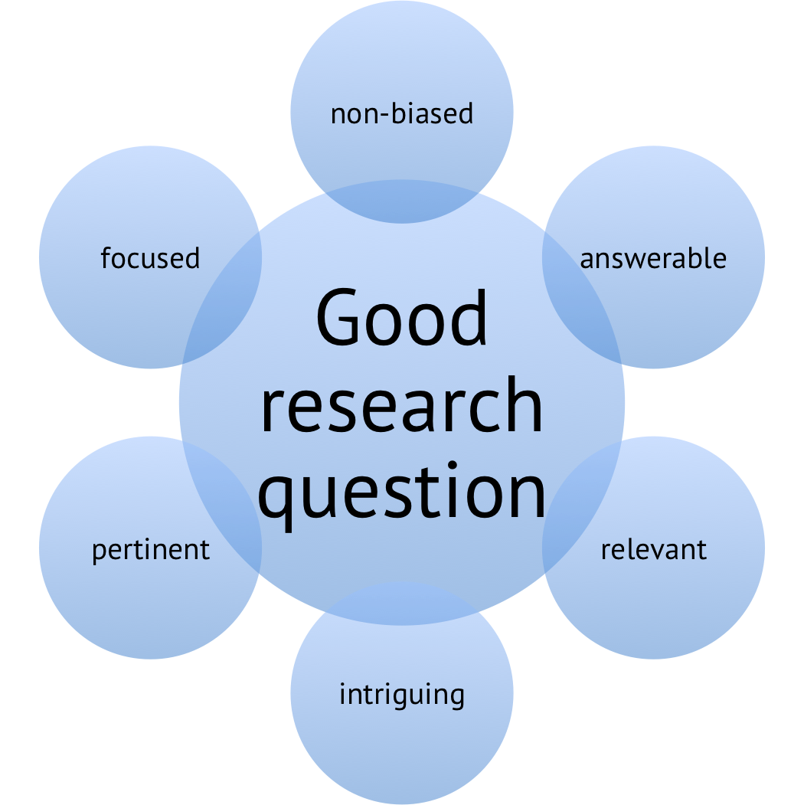
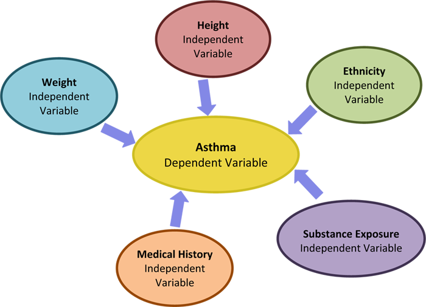
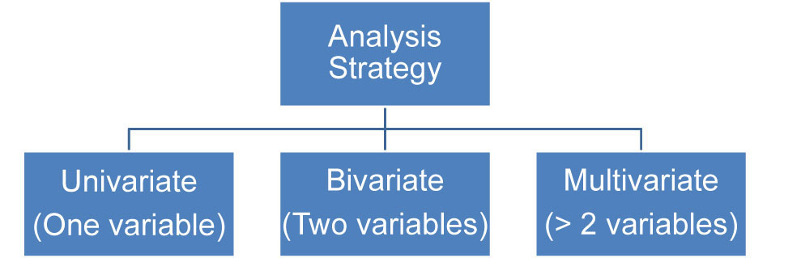
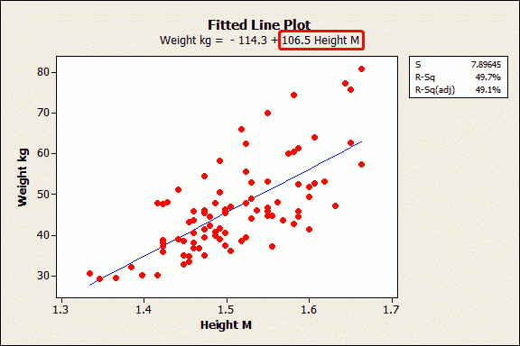

# Modeling Our Data 

## Introduction 

In this lesson we will look at the modeling process for running regression or similar statistical experiments. We have looked at most of the modeling techniques in last two sections. This lesson will help you combine all those steps and develop a framework of running an experiment. 

## Objectives
You will be able to:
    
* Identify the various steps involved  in building a model
* Understand that modeling is an iterative process
* Identify target variables and predictor variables

## Model Development 

Following steps will provide you with outline for building a regression model, iterating through different stages of model development and communicating the outcome of the experiments, 

### Step1: Identify an analytical/research question of interest which would be the goal of your analysis.

>A research question is a clear, focused, concise, complex and arguable question around which you center your research. You should ask a question about an issue that you are genuinely curious about. 

Research questions help you focus your analysis by providing a path through the iterative analytical process.

Steps to developing a research question:

* Choose an interesting general topic.  

A good example of a general topic might be "Use of mobile phones in the American Teens" or "10 Most profitable products in first quarter of 2018."

* Do some preliminary research on the domain under examination. 

Having a good degree of domain knowledge around your analytical question will always help you advance your analysis with domain specific analytical decisions, importance and relationship of predictors and communicating the results back to pubic domain. 

* Consider your audience. 

For most data science projects, your audience will be analysts or domain experts. Always keep your audience in mind when narrowing your topic and developing your question.

* Start asking questions. 

Once you have achieved all of above, start asking general "how" and "why" questions about your topic. For example, “ How do teens use mobile phones in their daily routines?" or "What makes a product profitable?". So you see a bit of domain knowledge creeping again. 

* Evaluate your question. 
            
Once you have an analytical question, you ask yourself if the question is clear? . Analytical questions must be as clear as possible in order to be effective in helping the analyst conduct and describe their analysis. 

### Step 2: Identify data required to build the model .

This is where you identify the data required to answer the question that you have posed. We have already seen independent and dependent variables in terms of model building ( We also call these predictors/features vs. target/outcomes). You need to describe Which variables do you expect to find important towards answering the question, as well as which target variable's behavior can best describe the outcome of the experiment. Here is a quick example to demonstrate how you would initially start setting up a model in terms of how some variables can be used either individually or combined , to investigate an outcome.  

You may also need to ask yourselves at this stage , questions like:
* Do we anticipate nonlinear patterns or interactions?
* What do we expect the coefficients to be? e.g., positive or negative?

### Step 3: Evaluate the data.

So we do now have a question to answer , along with a n initial indication on how some variables can be used to model a phenomenon. The next big questions you need to ask yourself are:
* Do we have enough data to run the experiment?
* Is the sample data representative of the population? 

In the upcoming sections on stats, we will cover topics like sampling from populations, sampling errors, sample size requirements etc. For now , we must understand that we usually work with samples of data instead of populations. And when we try to infer something about the population based on the sample data that we analyzed, we have to make sure that our inference and predictions can be generalized for a larger population.

### Step 4: EDA - Assess relationships (uni-variate and bi-variate)

We have been looking into plotting histograms, scatter plots and Q-Q plots to check for the assumptions that we have seen for regression analysis. Prior to conducting our experiments, it is imperative that we perform detailed analysis of variables to confirm these assumptions. 

In a nutshell, we will be performing following in this stage:
#### Identify scales, ranges, distributions of the various factors.
We need to check if our data normally distributed or skewed?Also, if there are any outliers present. We normally look at histograms, frequency tables and KDEs etc. to check for the distributions

#### Look at bivariate relationships. 
Here we use scatter plots, scatter matrices and time series plots (if appropriate). We check for the assumptions of linearity at this stage and visual checks with above techniques provide us an easy and reproducible way to show to the relationships between features and target variables. We also check for nonlinear relationships, Outliers, leverage points, level of association and possible Correlation among predictors to check for collinearity. 

### Step 5: Fit an initial model

> Modeling is an iterative process. No one gets it right the first time.

An initial model is usually based on your current understanding of the problem, in a form
that makes the most sense given the context. 

After running an initial model, we normally perform following steps:

* Assess the parameters (slopes, intercept) of the fitted model. 

* Check if the model explain much variation in data? (RMSE, F and R2)

* Check if the estimates are significant in terms of testing your hypothesis?
* Interpret the model coefficients, slopes and intercepts using appropriate units?
* Check  the impact of collinearity? Can you ignore it?

In addition to above you can also use visual aids to better evaluate your model in terms of goodness of fit and variance, distribution of error terms. We normally check if residuals are reasonable (i.e., constant variance, normal)?

### Step 6: Revise the fitted model.

Revision of the model mainly depends on how we choose our initial model and how we interpret the outcomes from the initial experiment. For regression specific analysis, specially when are dealing with multiple regression, multi-collinearity is always a big issue and it cant be avoided totally. Multicollinearity can also obscure the effect of predictors in a regression mode.  We tend to revise a regression model based on the selection of predictors and how they tend to correlate with each other. 

Predictive capability of a model is a great measure to identify and see if the effect of a revision actually improves or worsens some measure of predictive loss like root mean squared error. 

Significance of the model outcome can also be tested using hypothesis testing techniques like t-tests and f-tests (these will be covered soon). 

In addition to above, we can also consider following: 

* What factors explain the unexplained residual variation?
* Removing several is dangerous if collinearity is present.
* Check for missed nonlinearity.

### Step 7: Repeat above step until satisfied

So once we have iterated through the process mentioned above, and have some level of confidence in the out come and its predictive capabilities, we can further streamline the outcomes to make sure that we can interpret and communicate the end result in a domain specific manner. The description of the model and its outcomes must always be in the terms of original analytical question asked. 

We also have to make sure that we clearly understand the goodness of fit for our final model and the residuals are checked and explained in detail. 

Like e mentioned earlier and saw with some examples that linear regression can never fully describe a relationship and there will always be some level of unexplained variance. We can try to answer following questions to explain the limitations of our model:

* Does anything in the analysis suggest dependence?
* Do different groups have comparable variance?
* Are the data normal (quantile plot from saved residuals)?

## Summary 

In this lesson, we looked at the key steps towards building and evaluating a linear regression model. The first four key stages highlighted in this lesson have been covered in detail in the previous sections, and we'll move into modeling next. 
